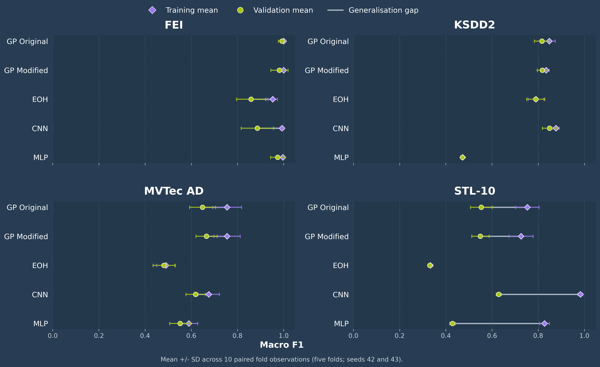

# Can AI Discover Explainable Feature Extractors?

**An empirical investigation in computer vision**

This Lancaster University MARS summer research project compares three
explainable feature-search methods with two neural baselines across four image
classification datasets.

[View the final symposium poster](presentations/symposium/MARS_symposium_poster.pdf)
· [Reproduce the experiments](docs/reproduction.md)
· [Inspect the results](docs/results.md)
· [Browse the weekly updates](presentations/README.md)

## Research question

Can AI-aided search discover compact, explainable feature extractors that
generalise to unseen image data?

| Family | Method | Learned representation |
|---|---|---|
| Explainable search | GP Original | Symbolic image-processing tree |
| Explainable search | GP Modified | Extended symbolic operator tree |
| AI-aided search | Evolution of Heuristics (EOH) | Eight-feature Python program |
| Neural baseline | CNN | End-to-end spatial representation |
| Neural baseline | MLP | Representation learned from flattened pixels |

## Main finding

No single representation won everywhere. GP Original was numerically strongest
on FEI, CNN on KSDD2 and STL-10, and GP Modified on the MVTec AD subset. The
explainable GP methods remained competitive on several tasks, while the CNN had
the clearest advantage on complex RGB STL-10 images. KSDD2 also showed why raw
accuracy can be misleading on imbalanced data: the MLP achieved high accuracy
while its balanced accuracy and macro F1 remained near majority-class levels.



## Experimental design

- Four datasets: FEI Faces, KSDD2, an MVTec AD subset, and STL-10.
- Five-fold stratified outer cross-validation.
- A common linear SVM downstream classifier for GP and EOH representations.
- EOH program selection nested within each outer training fold using an
  internal stratified 80/20 split.
- Seeds 42 and 43 for paired five-method inference.
- Neural seed 44 retained for descriptive robustness checks only.
- Validation macro F1 as the primary inferential metric.
- Nadeau-Bengio corrected paired tests with Holm adjustment within each dataset.

Full details are in [the experimental design](docs/experimental_design.md).

## Repository structure

```text
MARS-Summer-Research/
├── data/                         # Local datasets are ignored by Git
├── docs/                         # Design, results, and reproduction guides
├── figures/                      # Final performance and explainability figures
├── notebooks/                    # Final analysis plus development archive
├── presentations/               # Weekly updates and final symposium poster
├── programs/eoh/                 # 40 final fold-selected EOH programs
├── results/
│   ├── final/                    # Definitive fold results and summaries
│   ├── statistical_analysis/     # Corrected tests and descriptive checks
│   ├── explainability_analysis/  # GP/EOH structure and recurrence analyses
│   ├── poster_support/           # Figure source tables and manifest
│   └── search_provenance/        # Compact best-sample metadata for EOH
├── src/                          # Modular experiment implementation
├── tests/                        # Fast repository integrity tests
└── vendor/eoh/                   # Attributed upstream EOH implementation
```

## Quick start

The final project used Python 3.13. From the repository root:

```bash
python -m venv .venv
python -m pip install --upgrade pip
python -m pip install -r requirements.txt
python -m pip install -e vendor/eoh/eoh
```

Place the datasets under `data/raw/` as described in
[data/README.md](data/README.md), then run an experiment:

```bash
python -m src.experiments.run_experiment \
  --dataset fei \
  --method gp_original \
  --folds 5 \
  --seed 42 \
  --population 10 \
  --generations 2
```

To evaluate one saved EOH feature program without making an LLM request:

```bash
python -m src.experiments.run_experiment \
  --dataset stl10 \
  --method eoh \
  --folds 5 \
  --seed 42 \
  --eoh-program-file programs/eoh/stl10/seed_42/fold_1/selected_program.py
```

Fresh EOH search requires `DEEPSEEK_API_KEY` in the local environment. Keys and
datasets are never committed.

## Definitive outputs

- `results/final/final_master_folds.csv`: 240 fold observations, including
  descriptive neural seed 44.
- `results/final/final_paired_folds.csv`: 200 observations used for paired
  five-method inference.
- `results/final/final_master_summary.csv`: dataset/method summaries.
- `results/final/final_primary_pairwise_statistics.csv`: final primary-metric
  pairwise comparisons.
- `programs/eoh/`: all 40 nested-CV selected programs.

## Reproduce the analyses

```bash
python -m src.analysis.statistical_analysis
python -m src.analysis.explainability_analysis
python -m unittest discover -s tests -v
```

The poster graphics are generated by
`notebooks/analysis/poster_visualisations.ipynb`.

## Author and acknowledgement

James Davies, MSci Mathematics and Statistics, Lancaster University.

This work was completed through the Mathematics for AI in Real-world Systems
(MARS) programme, under the supervision of Dr Jixiang Qing, with support from
Reliable Insights.
